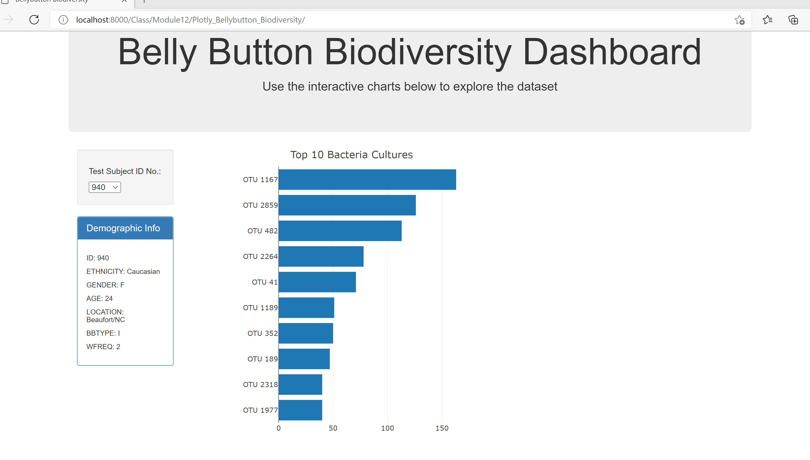
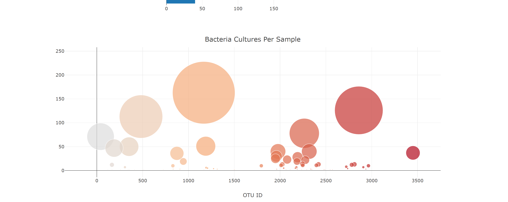
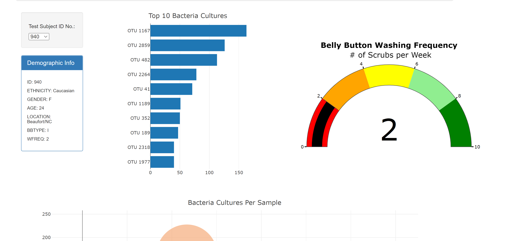
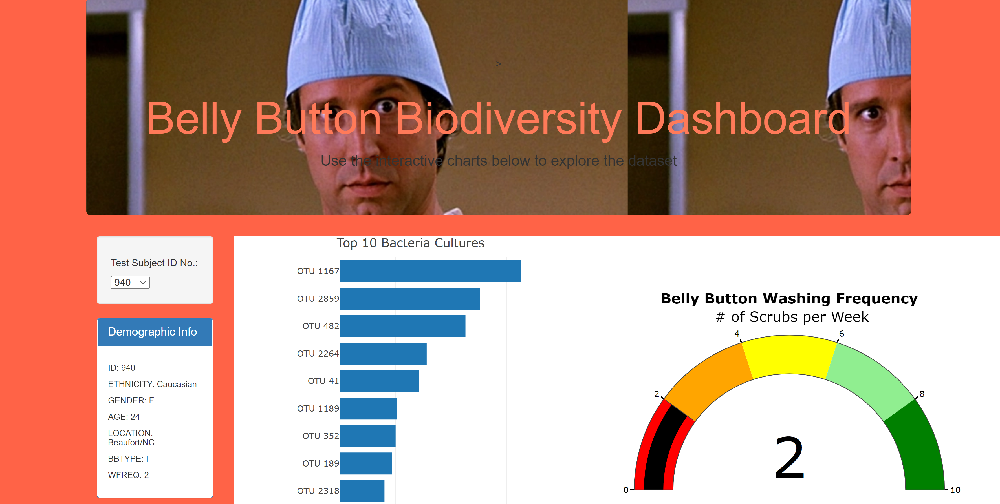

# Plotly_Bellybutton_Biodiversity By David Matheny on 3/5/2022

# Background
Roza has a partially completed dashboard that she needs to finish. She has a completed panel for demographic information and now needs to visualize the bacterial data for each volunteer. Specifically, her volunteers should be able to identify the top 10 bacterial species in their belly buttons. That way, if Improbable Beef identifies a species as a candidate to manufacture synthetic beef, Roza's volunteers will be able to identify whether that species is found in their navel.

# Deliverable 1:  The Bar Chart

# Deliverable 2:  The Bubble Chart

# Deliverable 3:  The Gauge Chart

# Deliverable 4:  The Bar Chart
For this deliverable I chose the following.
1) Add an image to the jumbotron.  I used Fletch because Fletch is awesome.
2) Add background color or a variety of compatible colors to the webpage. I chose Tomato because its ugly.
3) Use a custom font with contrast for the colors. I chose face="Arial" size="20px" color="#FF7A59"
